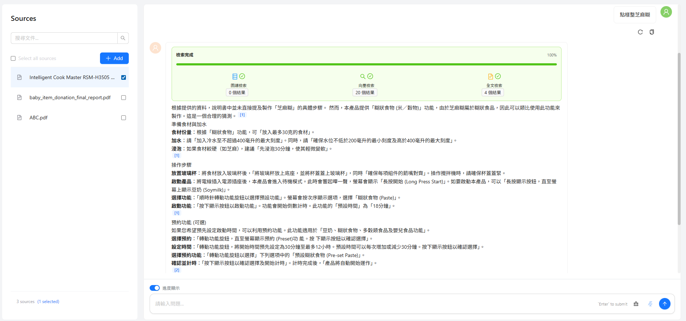

## RAG (Node.js + Neo4j + React + Vite)

A graph-centric RAG system: upload PDFs → split pages and chunks → generate embeddings and extract entities/relations → write into Neo4j → perform a hybrid query combining vector search, graph search, and full-text search → generate answers with citations. The frontend is built with React + Vite, and the backend exposes APIs with Node.js + Express.

---

### Project Structure

```text
RAG_nodejs/
  ├─ nodejsExpress/            # Backend (Express)
  │  ├─ config/neo4jDriver.js  # Neo4j connection settings
  │  ├─ routes/                # Upload / query / file management APIs
  │  ├─ services/              # Neo4j, AI, graph/vector processing
  │  ├─ utils/                 # PDF, API key management, etc.
  │  └─ index.js               # Server entry point (port 3000)
  └─ ReactVite/
     └─ vite-project/          # Frontend (React + Vite)
        └─ src/config.js       # Backend API base URL (VITE_API_BASE_URL)
```

---

### Features Overview

- **Document upload and processing**: `POST /upload-multiple` accepts single/multiple PDFs; automatically splits into pages/chunks, generates embeddings, extracts entities and relations, and writes to Neo4j.
- **Index automation**: Creates/checks Neo4j vector and full-text indexes on startup.
- **Multi-strategy retrieval**:
  - Graph (entity) retrieval
  - Vector retrieval (cosine similarity)
  - Full-text retrieval (Neo4j Fulltext Index)
  - Returns source metadata for each hit: `source` (file name), `fileId`, `page` (page number), `chunkId`.
- **Answer generation and source attribution**: `POST /query-stream` (SSE) integrates retrieval results and uses the Gemini model to generate answers with citations. The streamed final result contains:
  - `answer` (Markdown)
  - `answer_with_citations` with `source_reference` fields: `source_file`, `file_id`, `file_chunk_id`, `page_number`, `source_index`
  - `raw_sources` listing each chunk’s `content`, `source`, `pageNumber`, `score`, `fileId`, `chunkId`
- **File management**: List, query, and delete uploaded documents and their chunks via `GET /files`, `GET /files/:id`, `DELETE /files/:id`.

- **Frontend UI**:
  - PDF upload modal: drag-and-drop, multiple files.
  - Document manager: tabbed document view and list; quick switching between documents.
  - Document viewer: page/chunk preview with lazy loading for large files to improve performance.
  - Chat interface: ask questions and stream answers with inline citations.
  - Retrieval progress: visual indicators for retrieval stages and counts.
  - Clickable citations: jump to the source document/page/chunk in the viewer.
  - Responsive layout: adapts to different screen sizes.
  - Configurable API base URL via `VITE_API_BASE_URL`.

---

### Requirements

- Node.js 
- Neo4j 
- Neo4j with support for vector and full-text indexes (this project auto-creates `chunk_embeddings` and `chunk_text_index` on startup)
- Google Generative AI API key(s) (multiple keys supported for rotation)
- (Optional) Jina Reranker API key

---

### Backend Installation & Startup (nodejsExpress)

1) Create `.env` (path: `RAG_nodejs/nodejsExpress/.env`)

```ini
# Neo4j connection
NEO4J_URI=bolt+s://<your-aura-uri>
NEO4J_USERNAME=<your-username>
NEO4J_PASSWORD=<your-password>

# Google Generative AI (multiple keys, comma-separated; will auto-rotate)
GOOGLE_API_KEY_LIST=key1,key2,key3

# Optional; defaults are provided if not set
GOOGLE_AI_MODEL=gemini-2.5-flash
GOOGLE_AI_EMBEDDINGS=gemini-embedding-001

# Optional: if re-ranking is enabled
JINA_API_KEY=<your-jina-key>
```

2) Install dependencies and start

```bash
cd RAG_nodejs/nodejsExpress
npm install
npm start
```

- Backend default URL: `http://localhost:3000`
- On startup it automatically creates:
  - Vector index `chunk_embeddings` (dimension 3072, cosine)
  - Full-text index `chunk_text_index` (on `Chunk.text`)

---

### Frontend Installation & Startup (ReactVite/vite-project)

1) Create `.env` (path: `RAG_nodejs/ReactVite/vite-project/.env`)

```ini
VITE_API_BASE_URL=http://localhost:3000
```

2) Install and run the dev server

```bash
cd RAG_nodejs/ReactVite/vite-project
npm install
npm run dev
```

- Frontend default URL: `http://localhost:5173`
- `src/config.js` reads `VITE_API_BASE_URL`


